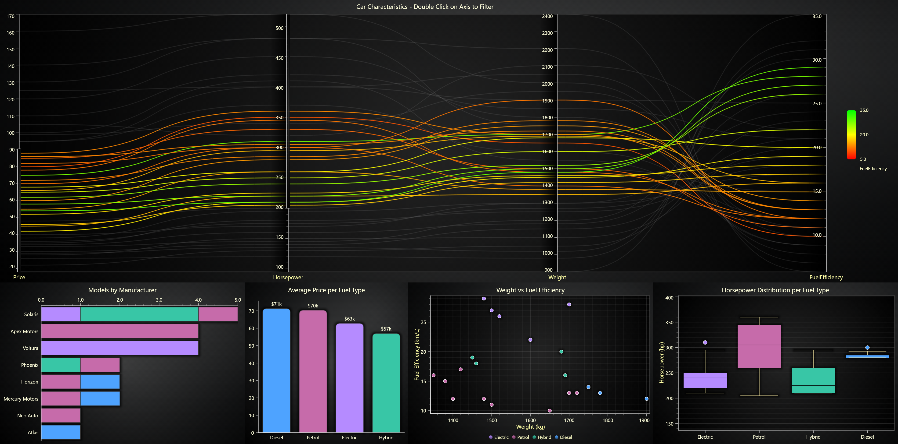

# Car Analytics Dashboard

This project is an interactive Car Analytics Dashboard built with **LightningChart JS**, a high-performance data visualization library for JavaScript.
The dashboard analyzes and visualizes simulated car characteristics across multiple dimensions, helping users explore relationships between manufacturer, model, fuel type, fuel efficiency, horsepower, and pricing.

LightningChart JS is a GPU-accelerated, performance-optimized charting library capable of rendering massive data sets with high interactivity and real-time responsiveness.
This project showcases its advanced chart types and linked data filtering through coordinated visualizations.

## Description

The Car Analytics Dashboard provides an interactive visual analytics experience for exploring simulated car characteristics.
It loads data from a locally generated dataset `cars.json` and connects multiple chart types that respond to user selections.
Filtering the parallel coordinate chart dynamically updates all others — allowing fluid, visual data exploration and comparison between simulated car models.

### Screenshot

*LightningChart JS Car Analytics Dashboard showing linked visualizations of simulated car data by fuel type and manufacturer*

### Key Features
- **Parallel Coordinate Chart (Main Filter)**: Visualizes multiple numeric attributes (price, horsepower, weight, fuel efficiency) across all simulated cars.
Users can double-click an axis to add range selectors and filter data interactively.
- **Linked Charts**: All visualizations are connected — filtering in the parallel coordinate chart automatically updates all others.
- **Dynamic Data Updates**: Charts update instantly based on selected car subsets, allowing smooth exploration of correlations between simulated attributes.
- **Custom Color Palette**: Consistent color mapping per fuel type across all charts (Petrol, Diesel, Electric, Hybrid).
- **Responsive Layout**: Multi-panel layout adapts to window size and maintains clarity on larger or smaller screens.

### Featured Chart Types
- **Parallel Coordinate Chart**: Explore relationships between Price, Horsepower, Weight, and Fuel Efficiency. Double-click axes to filter by ranges.
- **Horizontal Bar Chart**: Shows how many simulated car models each manufacturer has, broken down by fuel type.
- **Vertical Bar Chart**: Displays the average car price per fuel type.
- **Scatter Chart**: Illustrates the relationship between vehicle weight and fuel efficiency.
- **Box & Whisker Chart**: Shows the distribution of horsepower per fuel type, including quartiles and outliers.

### Data Source
The dashboard loads its data from a simulated dataset located at:
```bash
/assets/cars.json
```

## How to Use

- Make sure that relevant version of [Node.js](https://nodejs.org/en/download/) is installed (Node 16+ recommended).

- Create an `.env` file in the `/src` folder and add your license key there. You can see the format in `/src/.env.example`:
```
REACT_APP_LCJS_LICENSE="your_license_key_here"
```

- Install dependencies in terminal, in project root:
```bash
npm i
npm i @lightningchart/lcjs
```

- Start the development server:
```bash
npm start
```

- The application will be available at:
  - http://localhost:3000

### Controls & Interactivity
- **Double-click on an axis** (in the **Parallel Coordinate Chart**) to open a range selector for filtering.
- **All other charts** (bar, scatter, box) **automatically update** to reflect the selected range.
- **Hover and click** to view tooltips, zoom, or highlight specific data points.

### Project Structure
```bash
/public
 ├── assets/
 │    └── cars.json           # Simulated car data source
/src
 ├── App.css                  # Styling and layout configuration
 ├── App.js                   # Application entry
 ├── Charts.js                # Main chart container
 ├── index.css                 # Styling and layout configuration
 ├── index.js                 # React root rendering
 ├── LC.js                    # LightningChart context for shared instances
```

### Dependencies
- **Core**: React 19.2.0
- **Visualization**: @lightningchart/lcjs ^8.0.2

## Links
- [LightningChart JS Official Website](https://lightningchart.com/js-charts/)
- [LightningChart JS Documentation](https://lightningchart.com/js-charts/docs/)
- [LightningChart JS API Reference](https://lightningchart.com/js-charts/api-documentation/)
- [LightningChart JS Examples](https://lightningchart.com/js-charts/interactive-examples/)

## About the Creator
I'm an IT Engineering student passionate about software development, web technologies, and building practical projects.

This project is part of my internship at [LightningChart Ltd](https://lightningchart.com/), demonstrating how to build comprehensive data visualization dashboards with time-based data simulation, multiple chart types, and responsive design for various devices.

Feel free to connect or provide feedback!